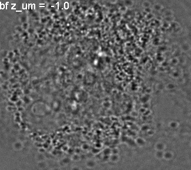
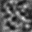
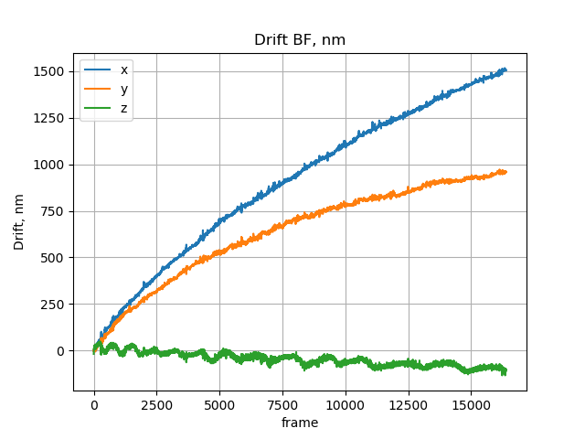
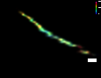
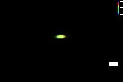

# Bright Field Drift Correction (BFDC)

Use bright field signal to trace the drift in 3D with nanometer precision.

You can try it with joy using our new platform Imjoy!

Just install the [Imjoy plugin engine](https://github.com/oeway/ImJoy-Python/releases) and
[Click this link](https://imjoy.io/#/app?w=drift&plugin=https://raw.githubusercontent.com/imodpasteur/Brightfield-Drift-Correction-3D/master/BFDC-Imjoy.html) to jump to the installation step of the script. Otherwise, click Add Plugin in Imjoy and paste [This link](https://raw.githubusercontent.com/imodpasteur/Brightfield-Drift-Correction-3D/master/BFDC-Imjoy.html) to the plugin installation URL line. Plugin will be installed autimatically with all necessary dependencies.

## Requirements
* python 3.6+
* All dependencies are automatically pulled during installation of BFDC

## Installation

We recommend using Conda virtual environment to run BFDC. Install [Miniconda](https://conda.io/miniconda.html) and type the following instructions in Anaconda promt (Windows) or Terminal (Unix / MacOS)

With Conda create a new environment with python 3.7:

`conda create -n pydrift python=3.7 -y`

Then activate it and run installation:

`source activate pydrift` (Unix / MacOS) `activate pydrift` (Windows) 

`pip install git+https://github.com/imodpasteur/Brightfield_Drift_Tracking_3D.git`

## Usage

In order to trace the drift in 3D a calibration stack needed (dict.tif).

Acquire bright field images with the same exposure (movie.tif) in order to trace the drift with nanometer precision.

You'll need to select a contrast region say 32x32 picels from the dict.tif and save as crop.roi (ImageJ ROI format)

### Tracing drift:
`python -m bfdc trace dict.tif crop.roi movie.tif`

### Applying drift to ZOLA table:
`python -m bfdc apply ZOLA_localization_table.csv BFCC_table.csv --smooth 10`

### Tracing and applying the drift in batch:
`python -m bfdc batch data_folder `

Expected file structure:

* data_folder 
  * **FOV**1
    * **dict**_LED_100nm
      *  dict_LED_100nm_Pos0.**ome.tif**
      * 32x32.**roi**
    * **sr**_ast_642_LEDskip9
      * **sr**_ast_642_LEDskip9.**Pos0.ome.tif**
      * **sr**_ast_642_LEDskip9.Pos0_1.ome.tif
      * ZOLA_localization_table.csv
  * FOV2
    * ... 
     
The possible arguments include:                                              
* Recursively parsing folders with fields of views (`--fov_prefix=FOV`)
* Looking for the folder with dictionary stack (`--dict_folder_prefix=dict`)
* Finding ROI file (`--ROI_suffix=roi`)
* Opening dictionary stack next to ROI (`--dict_suffix=ome.tif`)
* Opening STORM movie with bright field frames (`--sr_folder prefix=sr`, `--sr_movie_suffix=Pos0.ome.tif`)
* Automatically selects brightfield frames with background more than (`--filter_bg=100`)

### Help and possible arguments:

`python -m bfdc -h`

`python -m bfdc trace -h`

`python -m bfdc apply -h`

`python -m bfdc batch -h`

# Example of use
 
 Super resolution imaging of EDU Alexa 647 in the nucleus: beads photobleaching.
 
_l.gif) 
 
 Luckily, we have recorded the bright field movie along with the fluorescence by alternating illumination between illuimination and LED!
 
_l.gif) 
 
 How can we use it to trace the drift in 3D?
 
 Using the stack, recorded prior to imaging with the same exposure and same illumination intensity, we can reveal the drift from bright field only in 3D!

32x32 px crop form the dictionary and 64x64 crom form the movie tracks the drift with the precision higher than using beads and better sampling than redundant cross-corellation.

Stack crop 
Movie crop _crop32l.gif)

Note, how Nikon's Perfect Focus System struggles to maintain the focus!

 

Fluorescent bead track before and after BFDC.

 ->  

# Change log

V0.2.0 Processing tif file sets

V0.1.4 Batch processing 

V0.1.3 Avoid plots ovelaps from diffrent datasets

v0.1.2 Removing localizations from the ZOLA table if they come from bright field. 

v0.1.1 Automatically detecting BF frames based on intensity. No more need of skipping parameters to know.

 

